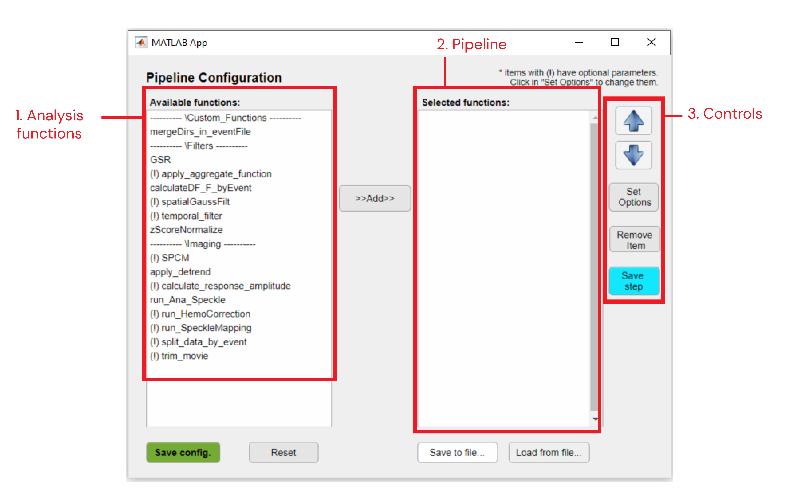

### Pipeline Configuration Interface

The pipeline configuration interface allows one to create, edit, save and load analysis pipelines.
This interface can be accessed both through the main GUI [Pipeline control panel](/../..docs/userDocs/maingui_pipeline.md) tab or using the standalone version of the [DataViewer](/dataviewer.md) app.
##### Interface components
___
<p align="center">
   <br>
  <em><strong>Pipeline Configuration Interface</strong></em>
</p><br>

##### 1. Analysis functions
List of the available analysis functions separated by category. These functions are located in `./umIToolbox/Analysis`.
Functions that have optional parameters are indicated by an exclamation point `(!)`.

To add a function to the pipeline, select the function from the list and click on the ***>>Add>>*** button.
##### 2. Pipeline
List of functions (steps) from the pipeline. The pipeline will run as the order shown in the list (from top to bottom).

##### 3. Step controls
* ***Up/down arrows:*** Move the selected step up/down across the list.
* ***Set Options:*** Opens a dialog box containing extra parameters for the selected function. Check the documentation of each function in the [analysis functions](/../../index.md/#analysisfunctions) section for details on optional parameters.
* ***Remove item:*** Removes the selected function from the pipeline.
* ***Save step:*** Saves the selected step to a  `.dat` file. Opens a dialog box to type the name of the .DAT file. Some functions do not provide imaging data as outputs and will not allow saving the step. Please, refer to the [analysis functions](/../../index.md/#analysisfunctions) section for details.
___
##### Saving/loading pipelines to/from a file
###### Saving a pipeline
One can *save* a pipeline by clicking on the **Save to file...** button. This will generate a **.JSON** file containing the list of functions and their respective custom parameters. If the configuration interface is called from main GUI (`umiToolbox`), the pipeline configuration files will be saved in the folder `PipeLineConfigFiles` inside the *save directory* of the project.
###### Loading a pipeline
To load a previously saved pipeline, simply click on **Load from file...** button and the pipeline will be loaded to the *Pipeline* list.
___
##### Executing the Pipeline

Once the pipeline list is completed, click on the green button **Save Config.** to send the pipeline for execution.

At this step, the pipeline will be checked for missing inputs. For instance, if the first step of the pipeline is a function that has a `.dat` file as input, a dialog box will appear with a list of files to select.

The pipeline execution itself is handled by the main interfaces (`umiToolbox` or `DataViewer`) once the configuration is concluded. Below is a step by step of how to execute a pipeline from both interfaces.

##### Running an analysis pipeline from *DataViewer* standalone app
___

To execute an analysis pipeline in the standalone version of the `DataViewer` app:
1. Open the imaging file to be processed.
2. Click on *Utilities >> Data Processing* to open the pipeline builder interface.
3. In the pipeline configuration interface, select the analysis functions to run on the file.
4. Click on *Save Config.*.
5. A window will appear containing a summary of the pipeline steps. Click on *Run* to run the pipeline.
6. Once finished, the final processed file will be displayed. If the last step of the pipeline was not saved during the pipeline creation in the Pipeline Builder interface, the file will be saved with a temporary file name with prefix ```tmpFile_```. You can save the processed imaging by clicking on *File >> Save as...*.

> Note: All temporary files (```tmpFile_xxxx.dat```) contained in the save directory will be deleted by closing the app. Be sure to save the displayed imaging data before closing.

##### Running an analysis pipeline from umIT's main interface (umIToolbox)
___

To execute an analysis pipeline from the main GUI of **umIT**:

1. In the *pipeline control panel* tab, select the objects to be processed in the folder tree.
2. Save selection by clicking on *Select* button.
3. Click on *Launch Pipeline Config* to open the pipeline configuration interface.
2. In the pipeline builder interface, select the analysis functions to run on the file.
3. Click on *Save Config.*.
4. In the *pipeline control panel* tab, a summary of the pipeline will be displayed on the *Pipeline status* panel.
5. Click on *Run Pipeline* to execute the pipeline over the selected objects.
6. Once finished, a table containing a summary of the pipeline will be displayed in the *Pipeline Summary* panel.


[**<< Home**](/index.md)
