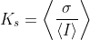

### run_SpeckleMapping

Calculates the average speckle contrast map from Laser Speckle Contrast Imaging(LSCI) raw data.

##### Description
___

This function reads the raw speckle data stored in `speckle.dat` file and calculates the temporal average of the speckle contrast defined by the equation below:
<p align="center">

</p><br>

where the speckle contrast (***K<sub>s</sub>***) is equal to the ratio of standard deviation(***&sigma;***) to the mean intensity (***I***) averaged across time.\
The speckle contrast can be calculated either in the spatial or the temporal dimensions [[1]](https://doi.org/10.1117/1.3285504). In brief, the estimation of the speckle contrast in space is obtained by calculating the standard deviation across a 5 by 5 pixel window which may decrease the spatial resolution. In contrast, if the calculation is performed in the temporal domain, the original spatial resolution is preserved.

##### Syntax
___

`outData = run_SpeckleMapping(SaveFolder)`: Calculates the speckle contrast map from the LSCI data stored in the file `speckle.dat` located in the folder `SaveFolder`.

`outData = run_SpeckleMapping(SaveFolder, opts)`: Calculates the speckle contrast map using optional parameters in the [opts](#opts---optional-parameters) structure.

`[outData, metaData] = run_SpeckleMapping(__)`: Outputs the meta data `metaData` associated with the data stored in `outData`.
##### Inputs
___
###### SaveFolder - save folder path
*character vector*   
Full path to the folder where the LSCI raw data `.dat` file is stored and where the speckle contrast map will be saved.

###### opts - optional parameters
*structure*   
Structure containing the optional parameters of the function.   
The `opts` structure has the following fields:
* *sType* (char) default = `'Temporal'`: Name of the domain to be used to perform the calculation. Set to `'Spatial'` to compute the standard deviation using a 5 by 5 area in the XY plane, otherwise set to `'Temporal'` to compute the standard deviation on a 5 by 1 vector in the time dimension.
* *channel* (char) default = `speckle`: Name of the `.dat` file containing raw LSCI data. The function will look for the file inside the `SaveFolder`.
* *bSaveMap* (bool) default = `false`: If **true**, the function will export the speckle contrast map as an image in TIFF format named `std_speckle.tiff` in `SaveFolder`.
* *bLogScale* (bool) default = `false`: If **true**, values of the speckle contrast map are scaled to a negative logarithmic base (`data = -log10(data);`).

##### Output(s)
___

###### outData - output array
*2D numerical matrix*   
Matrix with dimensions *Y,X* containing the speckle contrast map data.

###### metaData - data's meta data
*structure*   
Structure containing meta data associated with `outData`. For details, read the documentation of [loadDatFile](../../docs/devDocs/loaddatfile.md) function.

##### Examples
___

###### Calculate the speckle contrast map using the default parameters:
To calculate the speckle contrast map of raw LSCI data stored in `speckle.dat` file:\
`outData = run_SpeckleMapping('C:\ROOT\SAVEFOLDER');`\
In this case, the function will calculate the speckle contrast map on the time dimension of the raw LSCI data in `speckle.dat`.

###### Calculate the log-scaled speckle contrast map in the spatial domain:
First, create a structure `opts` with the necessary fields:
```
opts = struct();
opts.bType = 'Spatial'; % Set dimension to Spatial.
opts.channel = 'speckle';
opts.bSaveMap = false;
opts.bLogScale = true; % Transform data to a negative log scale.
```
Then, add the `opts` structure as input to the function:\
`outData = run_SpeckleMapping('C:\ROOT\SAVEFOLDER', opts);`

In this case, the function will calculate the speckle contrast map on the spatial dimension of the raw LSCI data in `speckle.dat` and output the data in a negative logarithmic scale.

##### References
1. Boas, David A., and Andrew K. Dunn. ‘Laser Speckle Contrast Imaging in Biomedical Optics’. Journal of Biomedical Optics 15, no. 1 (February 2010): 011109. https://doi.org/10.1117/1.3285504.

##### Links to related functions
___

[run_ImagesClassification]((../../docs/devDocs/run_imagesclassification.md)) \| [run_Ana_Speckle]((../../docs/devDocs/run_ana_speckle.md))


[**<< Home**](../../index.md)
