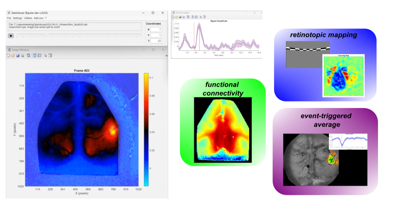

--- 
layout: default
title: Home
nav_order: 1
description: "umIT is designed to assist researchers in visualizing and analyzing large imaging datasets."
permalink: /
---

 
The umIToolbox, or umIT for short, is a MATLAB toolbox for processing, visualizing, and analyzing mesoscale imaging datasets. The current workflow centers on DataViewer, which combines image exploration, ROIs, temporal traces, pipelines, events, and project-aware tools.

Start with [Getting Started](./documentation/tutorials/gs_index.html), use the complete [DataViewer documentation](./documentation/userDocs/apps.html), or browse [Functions](./documentation/userDocs/fcns.html). Documentation for a previous release remains available under [Archived (previous release)](./documentation/archive/previous-release/index.html).

This open-source project is maintained by [LabeoTech](https://www.labeotech.com) and is under active development.

This toolbox is dedicated to our beloved friend ***Umit Keysan*** (1992-2019).
