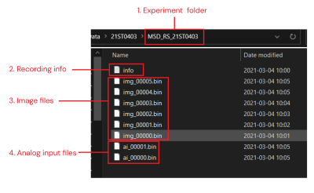
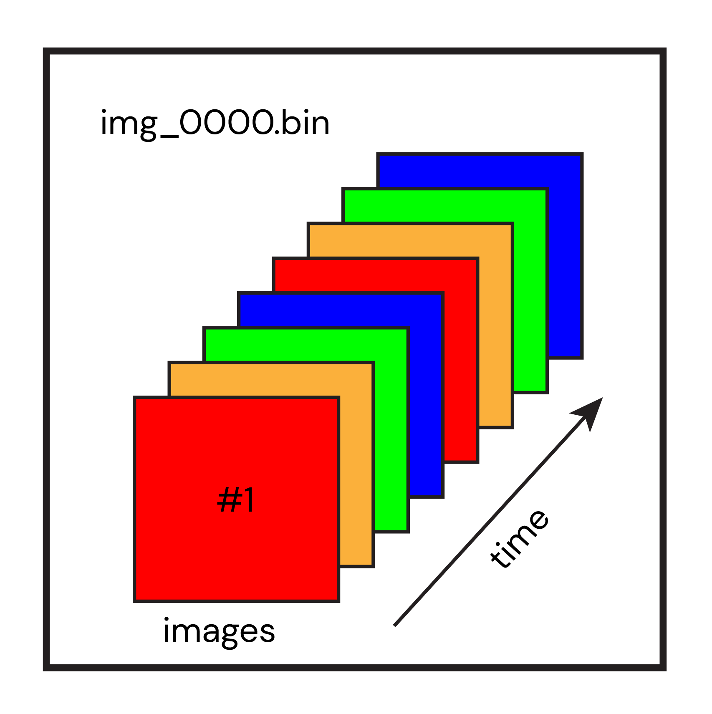
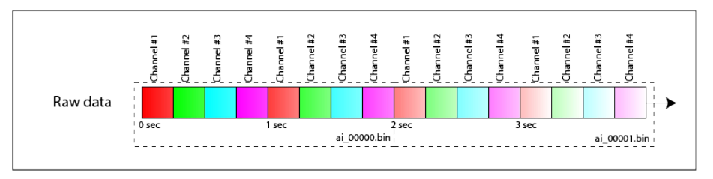

### Data Import from LabeoTech's Optical Imaging systems
The first step of data processing is the data import.
Here, we show how to import the imaging data generated by LabeoTech's optical imaging systems and discuss about the optional parameters that can be set to customize and optimize the importation of raw data.

First, an explanation about the structure of the raw and the imported data.   
##### How the raw data is organized
___

    
  <em>Organization of raw data in experiment folder.</em>

 

Each recording is saved in its own folder. Inside the folder, you will find three types of files:   

- info.txt : text file containing all the parameters of the acquisition system for the recording.
- image files (`img_xxxx.bin`): a series of binary files containing all images.    
- analog input files(`ai_xxxx.bin`): a series of binary files containing the signal from the analog input channels of acquisition system.

###### Organization of .bin files
The image files images (i.e. `img_xxxx.bin` files) contain the interleaved frames of one or more channels (i.e. illumination colors). For example, for a simultaneous recording of calcium and intrinsic signals of the brain one could use up to 4 channels (**R**ed, **G**reen and **Y**ellow for the intrinsic signals and a **F**luorescence channel for the calcium signal). For this particular example, the image frames are arranged as R-G-Y-F- R-G-Y-F- R-G-Y-F- ... R-G-Y-F in each binary file (see figure below).

   
  <em>Frames of color channels are interlaced in img_xxxx.bin files.</em>

 

The number of images contained in one binary file varies depending on the size of the frame captured during the recording. However, a maximum of 500Mb of data is allowed per file. Once a file is full, a new `img_xxxx.bin` file is created to store the next frames.   

Regarding the analog input files (`ai_xxxx.bin`), the organization of the data is different from the image files. The signals from the system's analog inputs are saved once every 2 seconds (and at the end of the acquisition). The transmission of the data from each analog channel is interlaced when received from the acquisition board. For each transmission, the new chunk of data is stacked at the end of the previous one. Once the file size limit is reached, a new `ai_xxxx.bin` file is created (see figure below).   

   
  <em>Organization of analog input data in ai_xxxx.bin files.</em>

 

##### How the imported data is organized
___

##### Importing the raw data
___

##### Customizing parameters
___

##### Further documentation
___

[**<< Home**](../../index.md)
