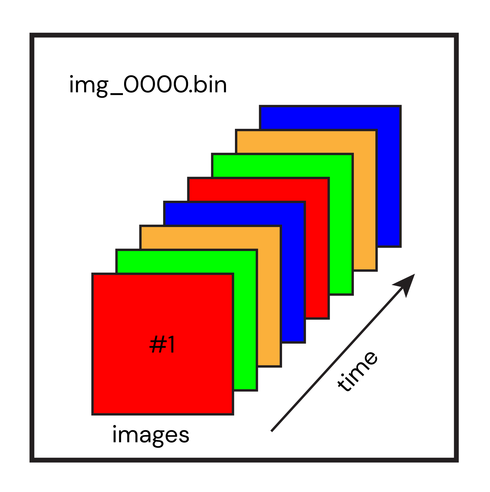

### Data Import from LabeoTech's Optical Imaging systems
The first step of data processing is the data import.
Here, we show how to import the imaging data generated by LabeoTech's optical imaging systems and discuss about the optional parameters that can be set to customize and optimize the importation of raw data.

First, an explanation about the structure of the raw and the imported data.   
##### How the raw data is organized
___

    
  <em>Organization of raw data in experiment folder.</em>

 

Each recording is saved in its own folder. Inside the folder, you will find three types of files:   

- info.txt : text file containing all the parameters of the acquisition system for the recording.
- image files (`img_xxxx.bin`): a series of binary files containing all images.    
- analog input files(`ai_xxxx.bin`): a series of binary files containing the signal from the analog input channels of acquisition system.

###### Organization of .bin files
The image files images (i.e. `img_xxxx.bin` files) contain the interleaved frames of one or more channels (i.e. illumination colors). For example, for a simultaneous recording of calcium and intrinsic signals of the brain one could use up to 4 channels (**R**ed, **G**reen and **Y**ellow for the intrinsic signals and a **F**luorescence channel for the calcium signal). For this particular example, the image frames are arranged as R-G-Y-F- R-G-Y-F- R-G-Y-F- ... R-G-Y-F in each binary file (see figure below).

   
  <em>Frames of color channels are interlaced in img_xxxx.bin files.</em>

 

The number of images contained in one binary file varies depending on the size of the frame captured during the recording. However, a maximum of 500Mb of data is allowed per file. Once a file is full, a new `img_xxxx.bin` file is created to store the next frames.   

Regarding the analog input files (`ai_xxxx.bin`), the organization of the data is different from the image files. The signals from the system's analog inputs are saved once every 2 seconds (and at the end of the acquisition). The transmission of the data from each analog channel is interlaced when received from the acquisition board. For each transmission, the new chunk of data is stacked at the end of the previous one. Once the file size limit is reached, a new `ai_xxxx.bin` file is created (see figure below).   

   
  <em>Organization of analog input data in ai_xxxx.bin files.</em>

 

##### Importing the raw data
___

The function used to import LabeoTech's raw data is called `run_ImagesClassification`.\
In brief, *run_ImagesClassification* will read the `img_xxxx.bin` files and save the images from each channel in a separate file with extension `.dat` (see [ this section](#how-the-imported-data-is-organized) for details on how the imported files are structured).

   
  <em>The function <strong>run_ImagesClassification</strong> creates one image file per channel.</em>

 

This function has optional parameters that allows one to apply spatial and temporal binning to the image data as well as to detect triggers generated by the optical imaging system. More info on parameter customization in the section [below](#customizing-parameters).

There are 2 ways of importing the raw data:

- Using the standalone version of [DataViewer](../../dataviewer.md):

  1- In the main figure, click on *File* and *Import Raw data*.\
  2- Select one (it doesn't matter which one) of the `img_xxxx.bin` files from the recording that you want to import.\
  3- Select a folder to **save** the imported data.\
  4- A window will appear containing the function's parameters. Change or keep the default values and click *Ok*.\
  5- Another window will appear with the summary of the operation. Click on *Run!* to execute the function.\
  6- At the end of the processing, a window will show the imported data in the save folder. Click on one of them to visualize.

- Using the [main interface](../../maingui.md) of *umIT*:

  Here, we assume that a ***project file*** was created. For more info on how to create a project file, click [here](/how_to_create_project.md). Also, check the documentation on the [*umIToolbox app*](../../maingui.md) to familiarize with the interface functionalities.

  1- Open the project file in the main GUI `umIToolbox`.\
  2- Navigate to the *Pipeline Control Panel* tab.\
  3- Highlight the recordings to be analysed.\
  4- Click on the green *Select* button.\
  5- Click on *Launch Pipeline Config.* to open the *Pipeline Builder App*. For details on how to use the app, click [here](/LINK.md).\
  6- Select the object to run the analysis. For example, *FluorescenceImaging* for calcium imaging datasets.\
  7- In the *Pipeline Builder App*, select the function *run_ImagesClassification* from the list of available functions and add it to the *Selected functions* column.\
  8- To change the default parameters of *run_ImagesClassification*, click on the function in the *Selected functions* column and click on *Set Options* button.\
  9- Click on the green *Save config.* button.\
  10- On the main interface, click on *Run Pipeline* to execute the function across the selected objects.\
  11- The imported data will be saved in the save folder of each object. In our example, the files will be saved in the *FluorescenceImaging* folder inside the folder of its corresponding *Acquisition* folder.

###### Customizing parameters

##### How the imported data is organized

##### Function(s) documentation
___
[run_ImagesClassification](../../docs/devDocs/run_ImagesClassification.md)

[**<< Home**](../../index.md)
