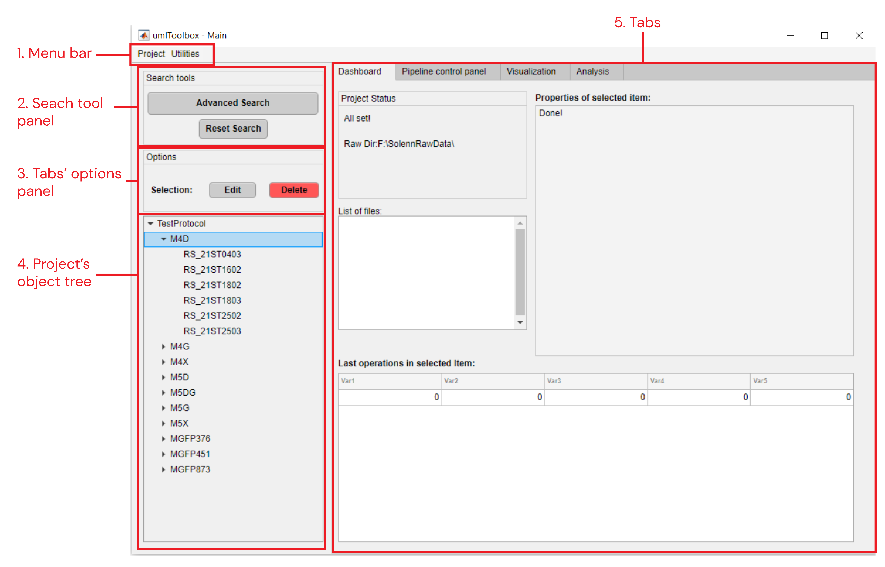
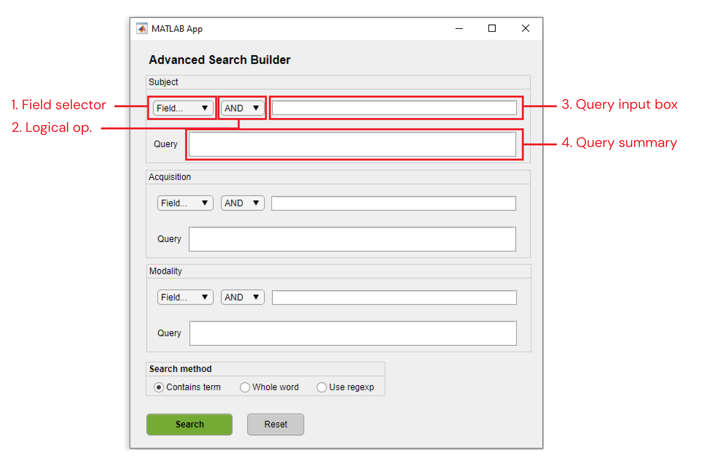
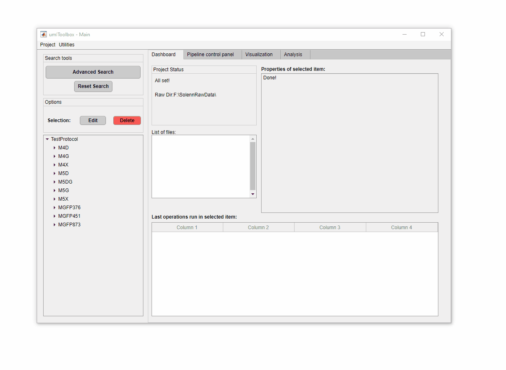

### The main user interface
___

The *Umitoolbox* main graphical user interface (GUI) allows one to create and manage a project and its datasets, configure and run analysis pipelines and launch visualization apps.

##### Syntax
___

`Umitoolbox`: Opens an empty interface. Create or load a [project file](/creating_a_new_project.md) from the interface to use the GUI.

`Umitoolbox(ProjFile)`: Opens the interface and automatically loads the project stored in `ProjFile` .mat file. The file `ProjFile` is a string with the full path to the project file.

##### Sections
___   

* [The interface](#the-interface)
* [Advanced search](#advanced-search)

#### The interface
___

    
  <em>Main graphical user interface.</em>

 

##### 1. Menu bar
**Project**
* ***New:*** Creates a new *project file*. Here, you will be asked to create a project name and to select the save and the raw data folders as well as to select the protocol function associated with the raw folder structure. For more info, see [*Creating a new project*](/creating_a_new_project.md).
* ***Open:*** Opens dialog to load previously saved *project file*.
* ***Save:*** Saves the currently opened *project file*.
* ***Save as...:*** Opens dialog to save currently opened *project file*.   

**Utilities**
* **Project >>**
    * ***Look for new data:*** Scans the raw directory for new/deleted recording folders.
    * ***Update Project:*** Updates the save folder subdirectories when new recordings are added to the raw folder.
    * ***View LogBook:*** Shows a table (data from *LogBook.mat* file in the save directory) with all operations performed in the data so far.
    * ***Reset LogBook:*** Erases the LogBook table.
    * ***Restore garbage list:*** Erases all objects listed in the *garbage list*. For more info, see [Managing experiment info](/ht_manage_exp.md).

##### 2. Search tool panel
Provides options for filtering the data shown in the *object tree*.

* ***Advanced Search:*** Launches an interface to filter the project items (Subjects/Acquisitions/Modalities). For more info see [Advanced Search](#advanced-search).
* ***Reset Search:*** Resets the *object tree* to show all items of the project.

##### 3. Tabs' options panel
This panel displays options for each tab. The content of the options panel changes depending on which tab is selected. For details on each tab's options, read the respective tab documentation in *section 5*.

##### 4. Project's object tree
Shows a tree containing the file structure of the project's save folder.\
The tree behaviour changes depending on the selected tab. *Dashboard* and *Visualization* tabs allow single-item selection while the *Pipeline control panel* tab allows multi-selection. The object tree is disabled when using the *Analysis* tab.

##### 5. Tabs
Here are the documentation regarding each tab:
* [Dashboard](/maingui_dashboard.md) (Experiment Management)
* [Pipeline control panel_LINKNOTFUNCTIONAL](/maingui_pipeline.md) (Data processing)
* [Visualization_LINKNOTFUNCTIONAL](/maingui_visualization.md) (Data visualization)
* [Analysis_LINKNOTFUNCTIONAL](/maingui_analysis.md) (Results visualisation and analysis)

#### Advanced search
___

The Advanced Search GUI allows one to filter the object tree elements using query terms on the object's properties such as **ID**.

    
  <em>Advanced Search graphical user interface.</em>

 

The Advanced Search interface is comprised of one search panel per object type (i.e. Subject, Acquisition and Modality) and a search method selector panel.
##### 1. Field selector
List of the object's properties to perform the search on.

##### 2. Logical operator
Logical operator that will be used with a second query term. Includes **AND**, **OR** and **NOT**.

##### 3. Query input box
Input box for the query terms. Type the term and press **Enter** to confirm.

##### 4. Query summary
Shows the final query term that will be used to filter the objects. The syntax works as follows:   
`(Term1[Field1]) OPERATOR (Term2[Field2])`\
For example, to search for the terms "OD" and "ST" in the ID field, the final query will be:\
`(OD[ID]) AND (ST[ID])`\
The query summary field is editable. So if you made a mistake in the query input box, it can be fixes in the Query summary box given that the syntax is maintained.

##### Search method panel

There are three options for the search query:
* Contains term: searches for the term anywhere inside the field.
* Whole word: searches for the field corresponding to the exact query term.
* Use regexp: the search term is interpreted as a [regular expression](https://www.mathworks.com/help/matlab/ref/regexp.html).

Note that the *Contains term* and *Whole word* options are case sensitive!

In order to create a search query, follow these steps:
1- First of all, select the object's property to query from the *Field selector*.
2- Type the query term and press **Enter**. Type one term at a time and use the logical operators to add new terms.
3- Once the query is completed (it should appear in the *query summary* box), click on **Search** button to filter the object tree in the main GUI.

    
  <em>Example of a query filter.</em>

 

\
[**<< Home**](../../index.md)                                                                   
