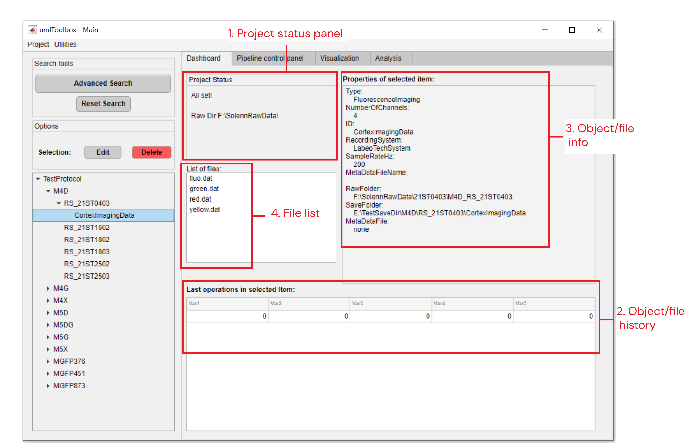
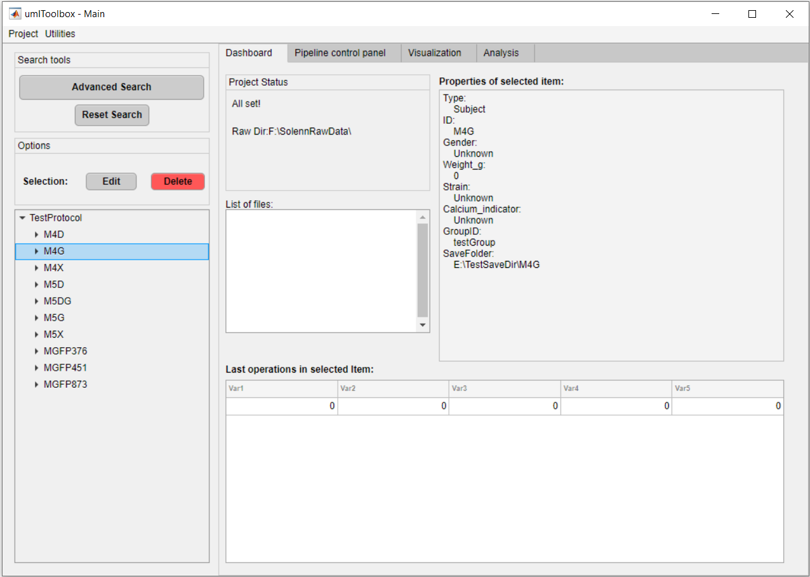
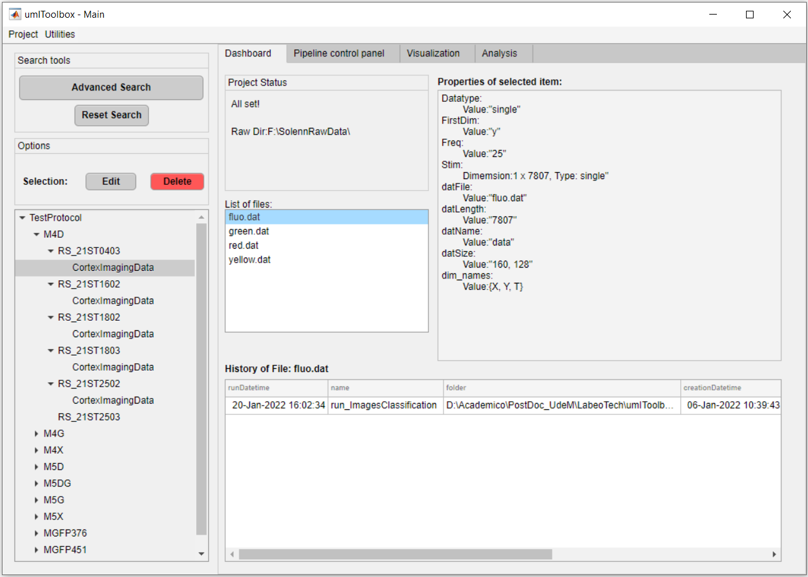
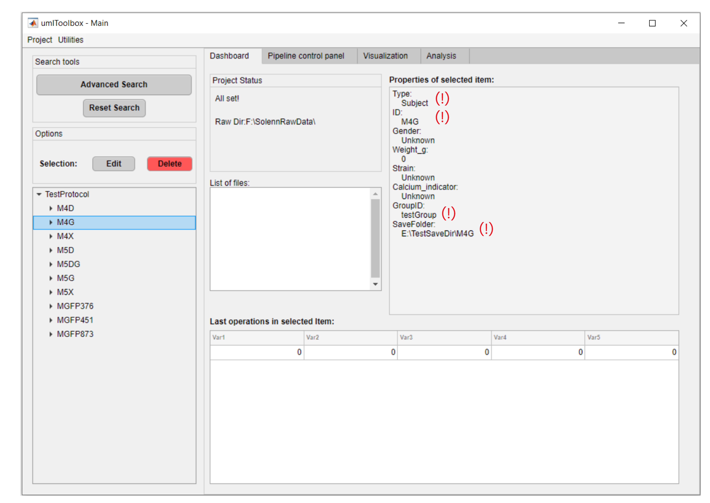
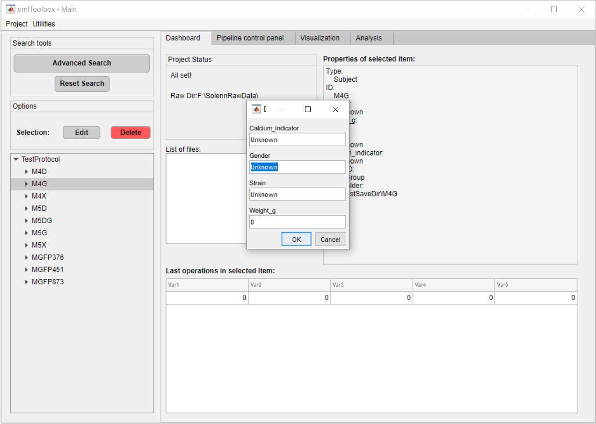
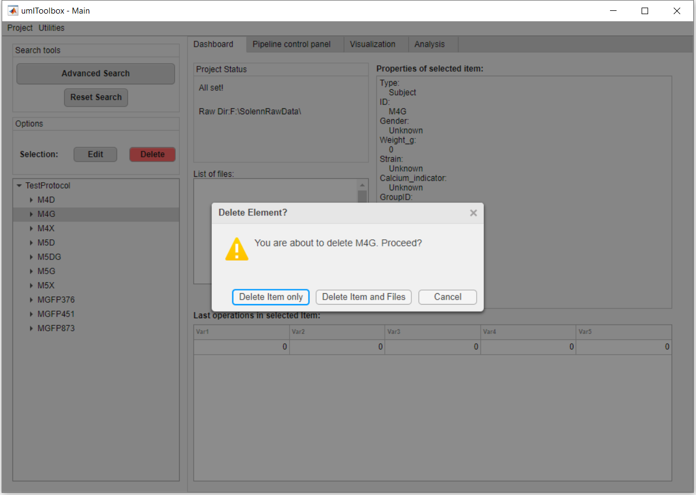

### Dashboard tab
___

This is the first tab of the main GUI. Here, one can visualize the project's objects meta data and files, as well as edit/delete objects.

#### Tab's components
___

    
  <em>Main components of <strong>Dashboard</strong> tab.</em>

 

##### 1. Project status panel
Panel that shows if the project file was successfully loaded. In addition, it shows if there are any changes in the raw folder (i.e. added or deleted recording files) when looking for new data (*Utilities >> Project >> Look for new data*) or when the project is updated (*Utilities >> Project >> Update Project*).

##### 2. Object/file history
Table with the last operations executed on the selected object from the *object tree* OR on the selected file (i.e. *data history*) listed in [file list](#4.-file-list).

##### 3. Object/file info
Panel showing the properties of the selected object in the *object tree* OR the meta Data associated with the selected file in [file list](#4.-file-list).

    
  <em>Properties of the Subject <strong>M4G</strong> selected in from the object tree.</em>

 

##### 4. File list
List box with `.dat` and `.mat ` files created using *umIT* located the save folder of the selected object. Select one of the files to show the data history and meta data info:

    
  <em>Meta data and data history of the file <strong>fluo.dat</strong> selected in the file list.</em>

 

#### Options
___

The options available in the Dashboard tab are to **edit** the properties of the selected object or to **delete** the object from the *object tree*.

##### Edit object's properties
Some of the properties of the project objects (i.e. Subjects, Acquisitions and Modalities) can be changed in the Dashboard tab. However, properties such as **ID**, are set during the object's creation - using the [protocol function](/creating_a_new_project.md) and are read-only (see figure below).

    
  <em>Read-only properties (<strong>(!)</strong>) of the <strong>Subject</strong> object.</em>

 

In the case of the figure above, one can edit the *Gender*, *Weight*, *Strain* and *Calcium Indicator* properties of the subject **M4G**:

  
<em>Click on <strong>Edit</strong> to edit the properties of the selected object.</em>

 
>Tip:\
It is always faster to set as many properties as possible during the object's creation inside the protocol function and leave the rest to be set manually in the **Dashboard** tab!

##### Delete an object
One can manually delete an object from the project. Only Subjects and Acquisitions can be deleted.\
Here, the deleted objects are erased from the project file and send to the *Garbage List*. The objects listed in the *Garbarge List* are blacklisted from the project and will be ignored next time the project is updated.
> Note:\
No raw files are deleted during this process. It is only possible to delete transformed files inside the object's Save folder. If you wish to delete the raw data, you have to do it manually outside **umIT** and update the project.

There are two options: to delete the object only OR to delete the object and all files inside the object's save folder:

    
  <em>Click on <strong>Delete</strong> to delete the selected object and select the delete option.</em>

 

\
[**<< Home**](../../index.md)
