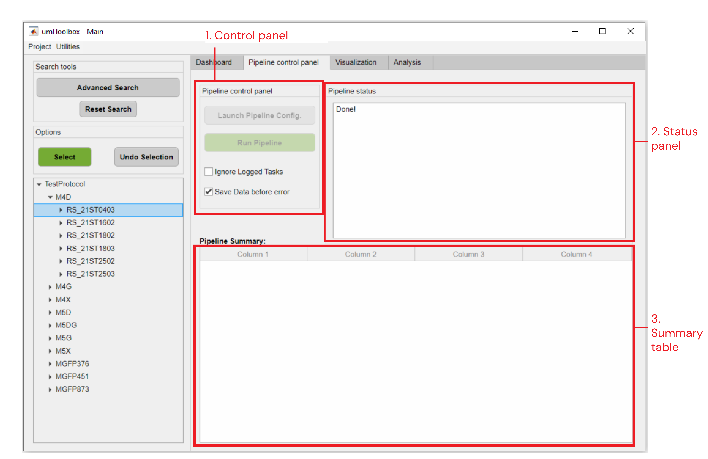

### Pipeline Control tab
___

Here, one can select objects to automatically run analysis pipelines.
Check the [user guide](../../docs/userDocs/ht_buildpipeline.md) for details on how to run pipelines!

#### Tab's components
___

    
  <em>Main components of <strong>Pipeline Control</strong> tab.</em>

 

##### 1. Control panel
Here, one can create/edit an analysis pipeline and apply it to the selected objects.
* ***Launch Pipeline Config:*** opens the [pipeline configuration interface](/pipeline_config_gui.md).
* ***Run Pipeline:*** Applies the analysis pipeline on the selected objects.
* ***Ignore Logged Tasks:*** Check this box to rerun a pipeline over the selected objects. By default, this option is disabled. Thus, analysis functions that were already applied over a file will be skipped.
* ***Save Data before error:*** This option automatically saves the last data created when an error occurs during the pipeline execution. This option is enabled by default.

##### 2. Status panel
This panel shows a summary of the pipeline steps and its parameters as well as the start and end timestamps of pipeline execution.

    
  <em>Example of information displayed in the <strong>Status panel</strong> tab.</em>

 

##### 3. Summary table
Once the pipeline execution is completed, a table is displayed with a summary of the steps performed in each object. Here, eventual errors are flagged and error messages are displayed.

    
  <em>Example of <strong>summary table</strong> after a pipeline execution.</em>

 

#### Options Panel
___

Here, the available buttons are used to **select** and **undo selection** of the highlighted objects from the *object tree*.

[**<< Home**](../../index.md)
