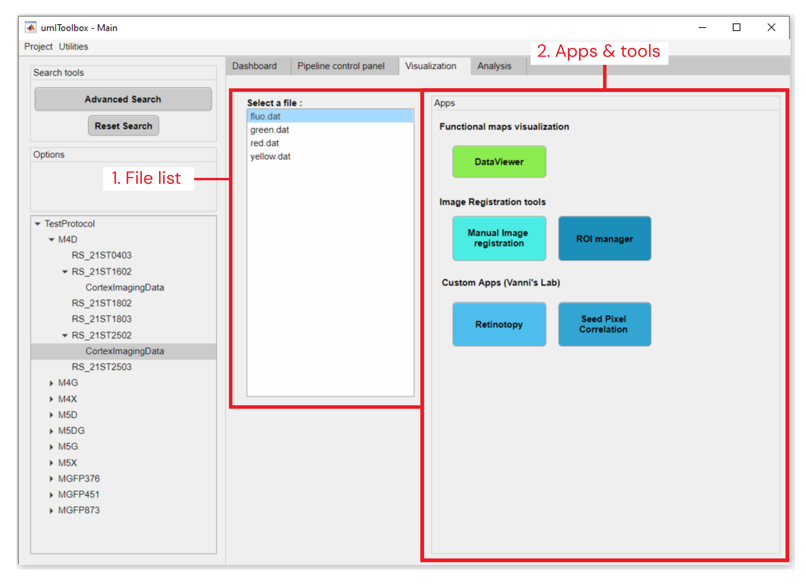

### Visualization tab
___

This tab provides apps and tools to visualize and manipulate imaging `.dat` files.
For more information on each app/tool refer to the apps section of the [Documentation](/../../index.md/#Documentation).

#### Tab's components
___

    
  <em>Main components of <strong>Visualization</strong> tab.</em>

 

##### 1. File list
List of `.dat` files located in the folders of the selected objects.
Select one of the files to be used as input for the apps and tools in the Apps tab.
##### 2. Apps & tools
This panel shows the available apps and tools that can be used to visualize and manipulate the `.dat` files.

[**<< Home**](../../index.md)
